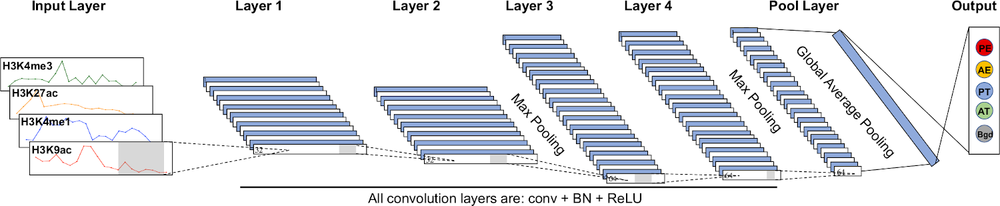
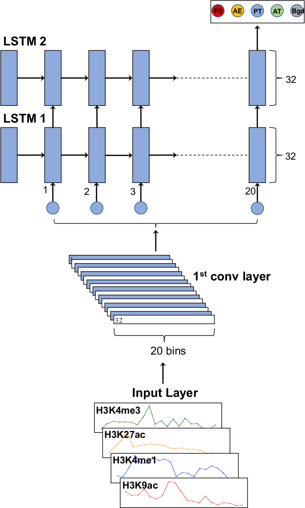
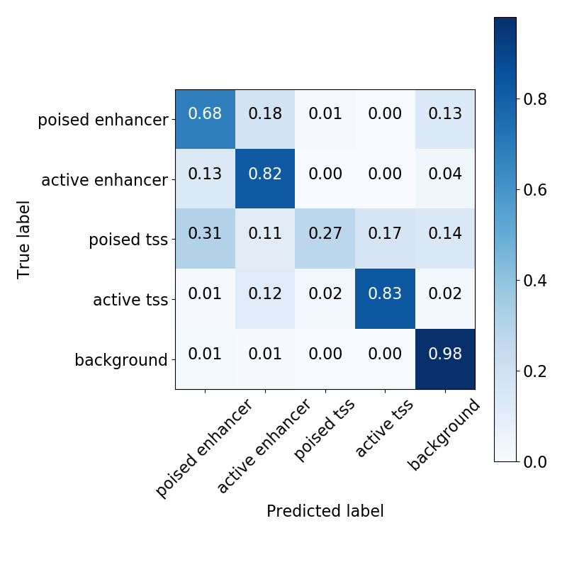

Shield: [![CC BY-NC-SA 4.0][cc-by-nc-sa-shield]][cc-by-nc-sa]

This work is licensed under a
[Creative Commons Attribution-NonCommercial-ShareAlike 4.0 International License][cc-by-nc-sa].

[![CC BY-NC-SA 4.0][cc-by-nc-sa-image]][cc-by-nc-sa]

[cc-by-nc-sa]: http://creativecommons.org/licenses/by-nc-sa/4.0/
[cc-by-nc-sa-image]: https://licensebuttons.net/l/by-nc-sa/4.0/88x31.png
[cc-by-nc-sa-shield]: https://img.shields.io/badge/License-CC%20BY--NC--SA%204.0-lightgrey.svg

# DeepRegFinder: *Deep* Learning based *Reg*ulatory Elements *Finder*
by Li Shen, Aarthi Ramakrishnan, George Wangensteen, Sarah Kim

Shen Lab Website: http://labs.neuroscience.mssm.edu/project/shen-lab/

Icahn School of Medicine at Mount Sinai, New York, NY, USA

**DeepRegFinder** is a deep learning based program to identify DNA regulatory elements using ChIP-seq. See our paper on *Bioinformatics Advances*:
- A. Ramakrishnan, G. Wangensteen, S. Kim, E. J. Nestler, and L. Shen, “DeepRegFinder: deep learning-based regulatory elements finder,” Bioinformatics Advances, vol. 4, no. 1, p. vbae007, Jan. 2024, doi: 10.1093/bioadv/vbae007.

## Overview
Identifying DNA regulatory elements such as enhancers and promoters has always been an important topic in the epigenomics field. Although certain histone marks are known to exhibit characteristic binding patterns at enhancers and promoters, the exact rules to classify them do not exist. This is where machine learning comes to the rescue. You can train a machine learning model on the ChIP-seq data of the known enhancers and promoters and then use the model to identify them elsewhere. 

Many machine learning algorithms for enhancer identification exist. However, most of them are designed for reproducing results on paper only. It's a hassle to apply them to your own data considering the most time-consuming part of a machine learning project is often data cleaning and formatting. We developed DeepRegFinder to be a modularized pipeline for you to build training data from aligned reads and genomic annotation easily so that you can use them to train models and make predictions. DeepRegFinder uses two deep neural networks: convolutional neural net (CNN) and recurrent neural net (RNN).

### Benchmarks

DeepRegFinder offers users the option to run three different types of classifications. Firstly, 2-way classification distinguishes enhancers from background genomic regions, including both generic background and promoter regions. Secondly, 3-way classification classifies enhancers, promoters, and generic background regions. Thirdly, 5-way classification can further classify enhancers and promoters into active and poised states for a given cell type, a feature which most existing tools lack. The 5-way classification therefore classifies any genomic region into active and poised enhancers (AEs and PEs, respectively), active and poised promoters (ATs and PTs, respectively), and background (Bgd).

We conducted a comparative analysis of DeepRegFinder's 3-way classification against five established methods, namely Random-Forest Based Algorithm for Enhancer Identification from Chromatin State (RFECS) (Rajagopal et al., 2013), enhancer HMM (eHMM) (Zehnder et al., 2019), PRobabilistic Enhancer PRedictIoN Tool (PREPRINT) (Osmala and Lähdesmäki, 2020), Enhancer Prediction using Deep Neural Network (EP-DNN or KimNet) (Kim et al., 2016), and ChromHMM (Ernst and Kellis, 2017). Following are the Precision and Recall values for Enhancers and Promoters for all tools -

| Tool name           | Cell Line | Region   | Precision | Recall | mAP  |
| ------------------- | --------- | -------- | --------- | ------ | ---- |
| DeepRegFinder (CNN) | K562      | Enhancer | 0.805     | 0.838  | 0.92 |
|                     |           | Promoter | 0.926     | 0.871  |      |
|                     | GM12878   | Enhancer | 0.79      | 0.848  | 0.92 |
|                     |           | Promoter | 0.913     | 0.889  |      |
|                     | HepG2     | Enhancer | 0.718     | 0.928  | 0.93 |
|                     |           | Promoter | 0.945     | 0.886  |      |
| DeepRegFinder (RNN) | K562      | Enhancer | 0.723     | 0.892  | 0.92 |
|                     |           | Promoter | 0.917     | 0.86   |      |
|                     | GM12878   | Enhancer | 0.712     | 0.921  | 0.91 |
|                     |           | Promoter | 0.941     | 0.859  |      |
|                     | HepG2     | Enhancer | 0.754     | 0.904  | 0.92 |
|                     |           | Promoter | 0.926     | 0.886  |      |
| EP-DNN (KimNet)     | K562      | Enhancer | 0.672     | 0.784  | 0.84 |
|                     |           | Promoter | 0.924     | 0.772  |      |
|                     | GM12878   | Enhancer | 0.697     | 0.858  | 0.88 |
|                     |           | Promoter | 0.954     | 0.811  |      |
|                     | HepG2     | Enhancer | 0.762     | 0.805  | 0.89 |
|                     |           | Promoter | 0.893     | 0.83   |      |
| RFECS               | K562      | Enhancer | 0.72      | 0.889  | 0.9  |
|                     |           | Promoter | 0.926     | 0.844  |      |
|                     | GM12878   | Enhancer | 0.744     | 0.913  | 0.91 |
|                     |           | Promoter | 0.94      | 0.856  |      |
|                     | HepG2     | Enhancer | 0.773     | 0.79   | 0.9  |
|                     |           | Promoter | 0.908     | 0.884  |      |
| eHMM                | K562      | Enhancer | 0.544     | 0.255  | 0.64 |
|                     |           | Promoter | 0.952     | 0.471  |      |
|                     | GM12878   | Enhancer | 0.474     | 0.381  | 0.63 |
|                     |           | Promoter | 0.998     | 0.389  |      |
|                     | HepG2     | Enhancer | 0.641     | 0.278  | 0.7  |
|                     |           | Promoter | 0.998     | 0.311  |      |
| PREPRINT            | K562      | Enhancer | 0.424     | 0.747  | 0.73 |
|                     |           | Promoter | 0.992     | 0.462  |      |
|                     | GM12878   | Enhancer | 0.394     | 0.801  | 0.72 |
|                     |           | Promoter | 0.997     | 0.428  |      |
|                     | HepG2     | Enhancer | 0.347     | 0.676  | 0.66 |
|                     |           | Promoter | 0.994     | 0.438  |      |
| ChromHMM            | K562      | Enhancer | 0.364     | 0.392  | 0.49 |
|                     |           | Promoter | 0.779     | 0.635  |      |
|                     | GM12878   | Enhancer | 0.376     | 0.443  | 0.51 |
|                     |           | Promoter | 0.813     | 0.645  |      |
|                     | HepG2     | Enhancer | 0.208     | 0.383  | 0.43 |

Overall, both CNN and RNN models of DeepRegFinder compare favorably with the other methods in precision and recall scores across all cell types. Additionally, DeepRegFinder is more parameter efficient than EP-DNN. The CNN and RNN have about 26K and 12K weight parameters, respectively, while EP-DNN has about 500K weight parameters. 

**References**:
1. Kim,S.G. et al. (2016) EP-DNN: A Deep Neural Network-Based Global Enhancer Prediction Algorithm. Scientific Reports, 6, 38433.
2. Rajagopal,N. et al. (2013) RFECS: A Random-Forest Based Algorithm for Enhancer Identification from Chromatin State. PLoS Comput Biol, 9, e1002968.
3. Zehnder,T. _et al._ (2019) Predicting enhancers in mammalian genomes using supervised hidden Markov models. _BMC Bioinformatics_, **20**, 157.
4. Osmala,M. and Lähdesmäki,H. (2020) Enhancer prediction in the human genome by probabilistic modelling of the chromatin feature patterns. _BMC Bioinformatics_, **21**, 317.
5. Ernst,J. and Kellis,M. (2017) Chromatin-state discovery and genome annotation with ChromHMM. _Nat. Protoc._, **12**, 2478–2492.

### Visualization of first convolution layer filters
One of the advantages of using convolution layers is that they tend to be easy to interpret. The following figure shows the activation patterns of the 32 1D filters of the first convolution layer of the CNN for the five classes (left panel) and the weights for a few example filters (right panel). As you can see, the activations show clear clusterings among the 32 filters and some filters are distinctly associated with certain classes. For example, filter 12 is exclusively associated with the active enhancer class and there is a clear peak detector for the H3K27ac histone mark.

### Network structures
Here is the CNN structure (click to see enlarged version):

Here is the RNN structure (click to see enlarged version):

### Multi-class classification analysis
Previous studies tend to focus on binary classifications between enhancer (as positive) and the rest (as negative), where promoters are lumped into the negative class. This can lead to an issue that the performance to distinguish enhancers from other regulatory elements becomes unclear. 5-way classification is used in DeepRegFinder. The following confusion matrix is from CNN predictions on the K562 cell type. We can see that for the active enhancer and promoter classes, the classifier is fairly accurate. However, the poised enhancer and promoter classes are often mistaken with other classes (click to see enlarged version):

## Run DeepRegFinder using the Docker image (recommended)
A Docker Image for DeepRegFinder is available at https://hub.docker.com/r/aarthir239/deepregfinder. Please read the documentation on the Docker Hub page to use the image.

## Installation
DeepRegFinder relies on Python 3 (>=3.6) so make sure that's the Python you are using. There are a number of dependencies that DeepRegFinder needs. You can install them as follows.

### Install dependencies using Anaconda
You may install the dependencies using [Anaconda](https://www.anaconda.com/). Download the project repository onto your workstation. Change into the downloaded repository and run the following command:

`conda env create -f environment.yaml`

This will create a conda environment called *deepregfinder*. Next, you may activate the environment using the following command:

`conda activate deepregfinder`

### Install dependencies using pip
First, download the project repository to your workstation. The dependencies and their versions in our development environment are listed in the `requirements.txt`. You may try to automatically install them by:

`pip install -r requirements.txt`

However, this approach may fail due to software incompatibility. In that case, you can manually install each package. If a particular version is incompatible or becomes unavailable, you may install the current default version and it shall work just fine.

### Install featureCounts
The preprocessing module relies on a program called `featureCounts` from the [Subread](http://subread.sourceforge.net/) package for short read counting. If you install the dependencies using Anaconda, the **Subread** package is already installed and you don't need to do anything. If you install the dependencies using pip, you'll need to install the **Subread** package manually and make sure `featureCounts` is in your `PATH`.

### Install DeepRegFinder
After all the dependencies have been installed, go to the project folder and run the following command to install DeepRegFinder:

`pip install -e .`

### About Operating Systems
DeepRegFinder has been tested under Linux and Mac. We never tested it under Windows. You may have to use a simulated terminal such as [Cygwin](https://www.cygwin.com/). 

## Running the pipeline
The pipeline has three modules: preprocessing, training and prediction. You can execute each module separately, which provides a lot of flexibility. The basic procedure for running each step is to first gather all the required input files, fill out a YAML configuration file and then run the corresponding program. We have provided example configuration files for you to easily follow. If you installed DeepRegFinder properly, the three `drfinder-xxx.py` scripts shall already be in your `PATH`. You can go to your own project folder and issue commands from there. Use the configuration files in DeepRegFinder's repository as your starting points.

### An example project
I understand how important it is to have an example for people to follow. Therefore I have created an example project with all annotations, bam files and configurations so that you can see how a project shall be structured. It can be accessed at this Google Dirve [folder](https://drive.google.com/drive/folders/1sW9KM9TnK6nqquf7nQniEpfTtiKtWVni?usp=sharing).

### Preprocessing
Fill out the configuration file: `preprocessing_data.yaml` and run this command:

`drfinder-preprocessing.py preprocessing_data.yaml <NAME OF OUTPUT FOLDER>`

To get histone mark ChIP-seq from ENCODE easily, a script (`create_histones_folder.py`) has been provided in the `scripts` folder. In the script, edit the section marked **edit the following** and run the Python script in background as follows:

`nohup python create_histones_folder.py &`

For your own ChIP-seq data, just follow the same file structure and put your BAM files under corresponding folders. Data for the folders `peak_lists` and `tfbs` may be obtained from [ENCODE](https://www.encodeproject.org/) and data for the `genome` folder may be obtained from [gencode](https://www.gencodegenes.org/). GRO-seq data can be found on [GEO](https://www.ncbi.nlm.nih.gov/geo/). You may have to process the GRO-seq data yourself to obtain the bam files to be used with DeepRegFinder.

After preprocessing is finished, the following files will be generated and required for training and prediction:

Under `tensor_data` directory:
- all_datasets.pth.tar
- chann_stats.csv

Under `histone_data` directory:
- alltogether_notnormed.txt.gz
- alltogether_notnormed.txt.gz.tbi

Under `tss_data` directory:
- enhancer_slopped_tss.bed

Under `tpms_data` directory:
- final_tpms.bed

Following are the options available in the preprocessing_data.yaml.  Each option is set to the default value in the file.

1.  **genome**: Specify the genome of interest. For example, hg19, hg38, mm10, rn6, rn7 etc.
    
2.  **train_chrom**: Fill this (and the following 2) lists only if you would like to split the train, val and test set by chromosomes. Or else, leave it empty. Specify the chromosomes you would like to include in the training data
    
3.  **val_chrom**: Specify the chromosomes you would like to include in the validation data
    
4.  **test_chrom**: Specify the chromosomes you would like to include in the testing data
    
5.  **window_width**: This is the bin size in bp. Default is 100
    
6.  **number_of_windows**: This is the number of bins. Default is 20. The 'window_width' and 'number_of_windows' parameters together define the length of regions for enhancers and promoter prediction (i.e., 20x100=2Kb)
    
7.  **num_classes:** There are 3 options for this parameter - 2, 3 or 5. 2-way classifies enhancers from background regions. 3-way classifies enhancers, promoters, and background regions. 5-way classifies active and poised enhancers (AEs and PEs), active and poised promoters (ATs and PTs), and background (Bgd).
    
8.  **genome_size_file:** Provide the filename of a tab-delimited text file consisting of chromosome name and the chromosome size. This parameter is used to select a subset of chromosomes. This is an optional argument. The main purpose of this is to allow you to select a subset of the chromosomes to quickly test out the whole pipeline. If this is not specified, the program will use all chromosomes in the following "valid_chromosomes" argument.
    
9.  **valid_chromosomes:** Specify the "valid" chromosomes to remove the unwanted scaffold chromosomes from training and prediction
    
10.  **histone_folder**: The path to the folder containing histone marks should be specified. The helper script DeepRegFinder/scripts/create_histones_[folder.py](http://folder.py) can be used to generate this folder. Please follow the following folder structure -

	histones
	├── histone1
	│ ├── histone1_rep1.bam
	│ └── histone1_rep2.bam
	└── histone2
	    ├── histone2_rep1.bam
	    └── histone2_rep2.bam
11.  **histone_log_transformation**: Whether you would like to log-transform the reads used for training and predicting enhancers and promoters.
    
12.  **cpu_threads:** Number of CPU cores.
    
13.  **generate_prediction_only**: Set this to True if you already have a trained model and wish to only generate data for prediction on the whole genome i.e., only the file alltogether_notnormed.txt.gz.
    
14.  **tss_file:** Path to the TSS (transcriptional start site) file in BED format. Coordinates in this file should be 1bp in length. This file may be generated using the helper script make_tss_genebody_txdb.R in DeepRegFinder/scripts
    
15.  **distal_bp_distance:** This is the distance used to slop TSS sites.
    
16.  **enhancer_distal_bp_distance:** The enhancers must be this distance away from TSS. This distance is also used to select background windows away from DNA regulatory elements.
    
17.  **H3K4me3_file**: Path to the peak file (BED) for H3K4me3. These peaks are used in addition to the TSSs so that we don't bump into these potential promoters.
    
18.  **DHS_file:** Path to the peak file of DHS (DNase I hypersensitive site) or ATAC-seq (Assay for Transposase-Accessible Chromatin with sequencing) data
    
19.  **enhancer_files:** Path to the peak lists used for defining enhancers. E.g. p300, CBP etc. You may specify multiple lists one below the other as follows -
    

	- 'example_dat/peak_lists/h1-p300-narrowpeaks.bed'
	- 'example_dat/peak_lists/h1-CBP-narrowpeaks.bed'

20.  **TFBS**: Provide the path to the peak lists for TFs that you believe to be enhancer associated. For example, for the H1 cell line, Nanog, Oct4 and Sox2 TFs are considered to be enhancers. Please list multiple files one below the other as for enhancer_files. If there are no TFBS files, you may comment out this field.
    
21.  **bkg_samples:** Total no. of background samples.
    
22.  **nz_cutoff**: This is the number of non-zero bins in a region. This cutoff is used to discard regions with low information content.
    
23.  **val_p**: Proportion of the validation set. Only applies if train_chrom, val_chrom and test_chrom fields are empty
    
24.  **test_p**: Proportion of the test set. Only applies if train_chrom, val_chrom and test_chrom fields are empty
    
25.  **groseq_bam_file:** Only applicable for 5 cls classification. Else, comment this out. Please specify the BAM file of GRO-seq data. You may also use PRO-seq, NET-seq or any other data that measures transcriptional activity of a DRE (DNA regulatory elements)
    
26.  **sense_bam_file:** Only applicable for 5 cls classification. Else, comment this out. If you have strand-specific GRO-seq data, please specify the file path to sense BAM file of GRO-seq data.
    
27.  **antisense_bam_file:** Only applicable for 5 cls classification. If you have strand-specific GRO-seq data, please specify the anti-sense BAM file path to anti-sense BAM file of GRO-seq data.
    
28.  **groseq_log_transformation:**
    
29.  **delete_intermediate_files:** Set to True if you would like to delete intermediate files

### Training
Fill out the configuration file: `training_data.yaml` and run this command:

`drfinder-training.py training_data.yaml <NAME OF OUTPUT FOLDER>`

The trained model, training result summary and confusion matrix are under the `model` directory.

Following are the options available in training_data.yaml. Default values for options are specified in the file.

1.  **all_datasets**: Please specify the path to the file named 'all_datasets.pth.tar' generated by the drfinder-preprocessing.py module
    
2.  **net_choice**: You may choose one from 'ConvNet', 'KimNet' or 'RecurNet'. ConvNet refers to CNN model of DeepRegFinder. RecurNet refers to the RNN model of DeepRegFinder. The model architectures for both CNN and RNN are preset. KimNet refers to an implementation of the EP-DNN model (https://www.nature.com/articles/srep38433).
    
3.  **num_classes**: There are 3 options for this parameter - 2, 3 or 5. Please set the one you chose for the preprocessing module
    
4.  **keep_cls_props**: Set this to True if you would like to keep the proportions of the non-background classes in training i.e., do not resample them to balance the classes
    
5.  **conv_rnn**: Set this to True if you wish to add a convolutional layer before RNN
    
6.  **init_lr**: Set the initial learning rate of the model
    
7.  **weight_decay**: Set the weight decay of the model
    
8.  **batch_size**: Set the batch size for the model i.e., number of samples in a single batch. It is common to choose the parameter batch size of powers of 2, such as 256
    
9.  **cpu_threads:** Number of CPU Threads available for running the training step.
    
10.  **best_model_name**: Please specify the name of the file you would like to save the best model in. Should have an extension of .pt
    
11.  **num_epochs**: Number of training epochs. One epoch refers to the entire dataset being passed through the neural network once.
    
12.  **check_iters:** Number of iterations in between the model performance checks. Iterations are determined based on the number of batches of data.
    
13.  **confus_mat_name:** Name of the file the confusion matrix will be saved to
    
14.  **pred_out_name:** Name of the file in which you would like to store the predictions made on the test set
    
15.  **summary_out_name:** Name of the file in which you would like to store the summary metrics such as the mAP, average precision for each class, precision and recall values for each class etc.
    
16.  **precision_recall_curve_name:** Name of the file the precision recall curve is saved to
    
17.  **roc_curve_name:** Name of the file the ROC curve is saved to
    
18.  **data_augment:** Whether to perform data augmentation. Leave it as False for now.

### Prediction
Fill out the configuration file: `wg_prediction_data.yaml` and run this command:

`drfinder-prediction.py wg_prediction_data.yaml <NAME OF OUTPUT FOLDER>`

A prediction summary and the predicted enhancers and promoters are under the `predictions` directory.

Following are the options available in wg_prediction_data.yaml. Default values are specified in the file.

1.  **whole_genome_bincnt_file**: Please specify the compressed genomic bin count file generated by the preprocessing module. Make sure the corresponding '.tbi' file is also in the same folder.
    
2.  **chann_stats_file**: Specify the file which stores hte mean and standard deviation of the histone marks used for training. This file is also generated by the training module
    
3.  **net_choice**: One of 'ConvNet', 'KimNet', 'RecurNet'. Please set this to the same model used in the training module
    
4.  **conv_rnn:** Set this to True if you wish to add a convolutional layer before RNN. Same as the value set for training module.
    
5.  **num_classes:** There are 3 options for this parameter - 2, 3 or 5. Please set the same one you chose for the preprocessing module
    
6.  **window_width:** This is the bin size in bp. Default is 100, same as the value set for preprocessing module
    
7.  **number_of_windows:** This is the number of bins. Default is 20, same as the value set for preprocessing module
    
8.  **batch_size:** Set the batch size for the model i.e., number of samples in a single batch for prediction
    
9.  **prob_conf_cutoff:** Output only the predictions with a probability score above this cutoff
    
10.  **data_augment:** Whether to perform data augmentation. Leave it as False for now. Same as training module.
    
11.  **known_tss_file:** specify the file containing known TSSs to subtract from predicted enhancers. This file is generated by the preprocessing module and is named 'enhancer_slopped_tss.bed'
    
12.  **model_state_dict:** Please specify the .pt file containing the saved model from the training module.
    
13.  **output_bed:** Specify the name of the output file to which you would like to save the whole genome predictions.
    
14.  **output_txt:** Specify the name of the output file to which you would like to save the whole genome prediction summary i.e., the validation rate for each class
    
15.  **tpms_file:** Specify the path to the file named 'final_tpms.bed' generated by the preprocessing pipeline. True positive mark (TPM) file is used to calculate enhancer validation rate. This is an output of the preprocessing module.
    
16.  **tpm_bps_added:** distance within TPMs to define "validated"

### Running time
Approximate time to run the three modules (assume you have a not-too-old GPU and a multi-core CPU):
- Preprocessing: 2-8h
- Training: 5 min
- Prediction: 20 min

### Cleaning up disk space
DeepRegFinder may generate a lot of intermediate files that take up a large amount of disk space. If you are running short on disk space, you may want to delete them. Particularly, two directories - `genome_data` and `histone_data` use the most space. Feel safe to delete the `genome_data` directory. For the `histone_data` directory, only two files are needed: `alltogether_notnormed.txt.gz` and `alltogether_notnormed.txt.gz.tbi`; you may delete everything else.

# TERMS OF USE
All data is free to use for non-commercial purposes. For commercial use please contact [MSIP](https://www.ip.mountsinai.org/).

